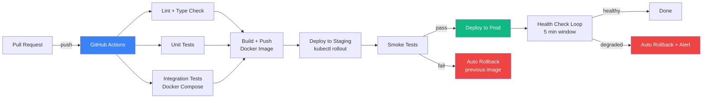

# CI/CD Pipeline with Self-Healing Deployments

A full deployment pipeline that builds, tests, and deploys containerized applications to Kubernetes — and automatically rolls back if health checks fail post-deploy, with zero manual intervention.

## Pipeline Overview



## Self-Healing Logic

After every production deploy, the pipeline watches Kubernetes health metrics for a 5-minute observation window. If any of these conditions are detected, it automatically rolls back and pages on-call:

| Trigger | Threshold |
|---------|-----------|
| HTTP error rate | > 1% of requests |
| Pod restarts | > 2 in 5 min |
| Readiness probe failures | Any pod not ready > 60s |
| Latency p99 | > 2x pre-deploy baseline |

```yaml
# Kubernetes deployment with rolling update + readiness gate
strategy:
  type: RollingUpdate
  rollingUpdate:
    maxSurge: 1
    maxUnavailable: 0   # zero-downtime deploys
readinessProbe:
  httpGet:
    path: /health
  failureThreshold: 3
  periodSeconds: 10
```

## Pipeline Stages

| Stage | Tool | What It Does |
|-------|------|-------------|
| Lint | ESLint / Ruff | Catch style + type errors |
| Unit Tests | Jest / pytest | Fast isolated tests |
| Integration Tests | Docker Compose | Real DB + service deps |
| Build | Docker + BuildKit | Multi-stage optimized image |
| Push | GHCR / ECR | Tag with git SHA |
| Deploy | kubectl | Rolling update, zero downtime |
| Smoke Tests | k6 / curl | Hit critical endpoints post-deploy |
| Health Watch | Custom Go script | Monitor error rate for 5 min |
| Rollback | kubectl rollout undo | Instant revert to last good image |

## Tech Stack

| Layer | Technology |
|-------|-----------|
| CI | GitHub Actions |
| Containers | Docker + Docker Compose |
| Orchestration | Kubernetes (k8s manifests) |
| Registry | GitHub Container Registry (GHCR) |
| Health Monitoring | Prometheus + custom rollback script |
| Notifications | Slack webhook on deploy / rollback |

## Project Structure

```
cicd-self-healing/
├── .github/
│   └── workflows/
│       ├── ci.yml             # Lint + test on every PR
│       └── deploy.yml         # Build + deploy on merge to main
├── k8s/
│   ├── deployment.yaml        # App deployment with readiness probes
│   ├── service.yaml
│   ├── hpa.yaml               # Horizontal pod autoscaler
│   └── ingress.yaml
├── scripts/
│   ├── health-watch.sh        # Post-deploy observation loop
│   └── rollback.sh            # Trigger rollback + notify
├── docker-compose.yml         # Local dev + integration tests
└── README.md
```

## Key Features

- Zero-downtime rolling deploys via Kubernetes
- Automatic rollback triggered by error rate or pod instability
- Separate staging and production environments
- Image tagged by git SHA — every deploy is fully traceable
- Slack notifications on deploy start, success, and rollback
- GitHub Environments with required reviewers for production
